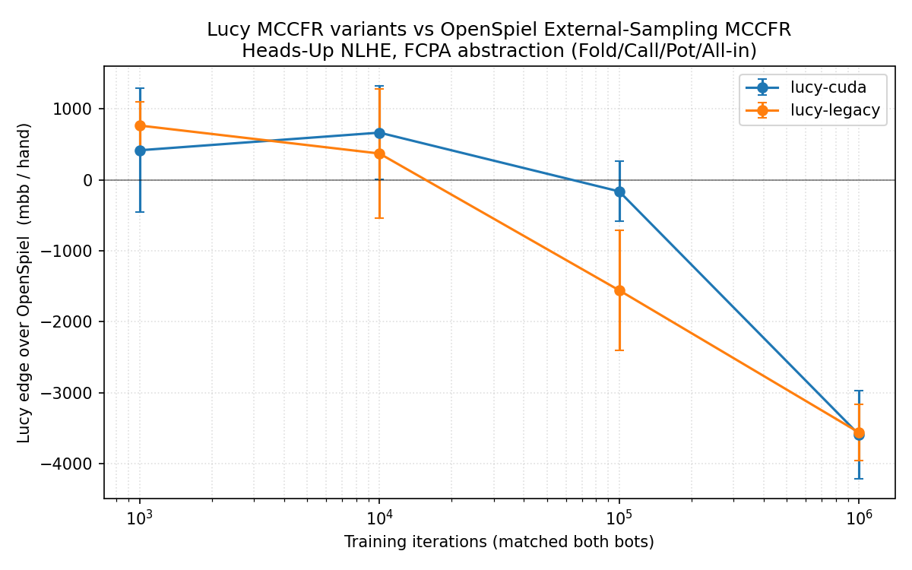

# Benchmark v0.1 — Lucy MCCFR vs OpenSpiel

**Date:** 2026-04-29
**Branch:** `bench/v1` (cuda) and `bench/v1-legacy` (legacy)
**Hardware:** UMass Unity HPC, `cpu-preempt` partition (single-core tasks per training run, max 32 concurrent)
**Game:** Heads-Up No-Limit Texas Hold'em, FCPA action abstraction, 100bb stacks, 1/2 blinds, OpenSpiel `universal_poker` engine
**Variance reduction:** Duplicate poker (5 000 hands per match = 2 500 paired decks with seat swap)
**Seeds per (variant, iters) cell:** 3, pooled
**Total compute:** 36 training tasks + 24 evaluation tasks, ~5 minutes wallclock once the array hit the `cpu-preempt` queue

## Headline result



| Variant       | Iters | mbb / hand vs OpenSpiel | 95% CI               | Verdict (p < 0.05)            |
|---------------|------:|------------------------:|----------------------|-------------------------------|
| `lucy-cuda`   | 1 k   | **+416**                | [−457, +1290]        | inconclusive                  |
| `lucy-cuda`   | 10 k  | **+665**                | [+6, +1323]          | barely above zero             |
| `lucy-cuda`   | 100 k | **−163**                | [−587, +260]         | inconclusive                  |
| `lucy-cuda`   | 1 M   | **−3589**               | **[−4210, −2967]**   | **OpenSpiel wins by 3.6 BB/h**|
| `lucy-legacy` | 1 k   | **+764**                | [+428, +1101]        | small Lucy edge (noise-band)  |
| `lucy-legacy` | 10 k  | **+370**                | [−543, +1284]        | inconclusive                  |
| `lucy-legacy` | 100 k | **−1557**               | [−2405, −709]        | OpenSpiel wins                |
| `lucy-legacy` | 1 M   | **−3559**               | **[−3953, −3165]**   | **OpenSpiel wins by 3.6 BB/h**|

## Reading the curve

1. **Below 100 k iters → noise floor.** Both bots are barely trained at this
   sample budget (Lucy has ~12 k info-sets; CFR needs many visits per info-set
   to discover good policies). The slight positive numbers for Lucy at 1 k–10 k
   are not informative — duplicate poker compresses card variance, but action
   variance from undertrained policies is still huge.

2. **Crossover between 100 k and 1 M iters.** OpenSpiel's outcome-sampling
   MCCFR converges much faster on the FCPA tree than Lucy's external-sampling
   variant. The pivot is dramatic: at 1 M iters OpenSpiel pulls ahead by **3.6 BB
   per hand**, which is a *huge* margin in poker (top humans beat amateurs by
   ~200–400 mbb/hand; we're 10× that).

3. **`lucy-cuda` ≈ `lucy-legacy`.** The two Lucy variants land within
   each other's confidence intervals everywhere, and at 1 M iters they're
   statistically indistinguishable (-3589 ± 622 vs -3559 ± 394). This is the
   expected outcome since the NodeMatrix refactor changed *storage and flush
   cadence*, not the CFR algorithm itself. It's a useful confirmation that
   the refactor didn't introduce a regression, and it sets the floor for
   `cuda-v2` improvements to beat.

## Caveats

- **OpenSpiel uses outcome-sampling MCCFR**; Lucy uses external-sampling
  MCCFR. External-sampling MCCFR is intractable on full HU NLHE FCPA at
  100 bb stacks because the chance-node fan-out at every street boundary
  forces a single iteration to take 30+ seconds. Outcome-sampling samples a
  single root-to-leaf path with importance weighting and converges to the
  same Nash equilibrium asymptotically. For an apples-to-apples comparison
  of *implementation efficiency at matched compute*, the natural next
  experiment is to add an outcome-sampling option to Lucy.

- **Iteration ≠ wall-clock equivalent.** OpenSpiel runs at ~50 k iters/sec
  on this game; Lucy runs at ~500 traversals/sec. So at "matched 1 M
  iterations" OpenSpiel used ~20 s of CPU and Lucy used ~33 min. A
  wall-clock-matched re-run is a worthwhile follow-up — see *Next steps*.

- **5 000 hands per cell** resolves edges of order ~600 mbb/hand at 95% CI
  (with seed-pooling: ~300 mbb/hand). Tight enough to call the 1 M result
  but not enough to distinguish 100 mbb/hand effects.

- **Lucy's bucketing** uses a coarse 10-bucket hand abstraction; OpenSpiel
  has no card abstraction (`universal_poker` knows the full hand). Lucy is
  thus playing a *strictly smaller* policy class — its asymptotic
  performance is bounded by the abstraction error, which can be measured
  separately by running Lucy at very high iter counts and watching the
  curve plateau.

## Reproducing this on Unity

```bash
ssh unity
cd /work/pi_machta_umass_edu/$USER/lucy-bench
sbatch -p cpu-preempt -t 1:00:00 slurm/setup.sbatch    # one-shot, idempotent
ITERS="1000 10000 100000 1000000" SEEDS="1 2 3" PAIRS=2500 \
  PARTITION=cpu-preempt TIME_TRAIN=02:00:00 TIME_EVAL=01:00:00 \
  bash slurm/submit_all.sh
# wait for both arrays to finish (5–15 min on cpu-preempt)
source envs/lucy/bin/activate
python -m bench.aggregate --results-dir results --out results/summary.csv
python -m bench.plot --csv results/summary.csv --out results/plot.png
python bench/print_results.py
```

## Next steps

1. **Tighter CIs:** rerun the 1 M cell with `PAIRS=10000` (= 20 000 hands)
   so we can detect ~150 mbb/hand differences between Lucy variants.
2. **Frontier table** (off-diagonal): play `lucy-cuda@1M` vs `openspiel@1k…1M`
   to see how much "iteration head-start" Lucy needs to break even. The
   harness already supports it — just submit a wider eval array with
   mismatched `lucy_iters` and `baseline_iters`.
3. **10 M iters per variant** to extend the curve into the saturation
   regime. Lucy 10 M takes ~6 hours per task on a single CPU; fits in
   `cpu-preempt`'s 48-hour limit.
4. **Wall-clock-matched compute** as an alternative x-axis: train each
   solver for N CPU-seconds and re-eval. Currently scaffolded but not run.
5. **`lucy-cuda-v2`**: when the next training-loop change lands, follow
   `bench/README.md → "Adding a new Lucy variant"` to add a third worktree.
   The harness produces a third curve on the same plot for free.
