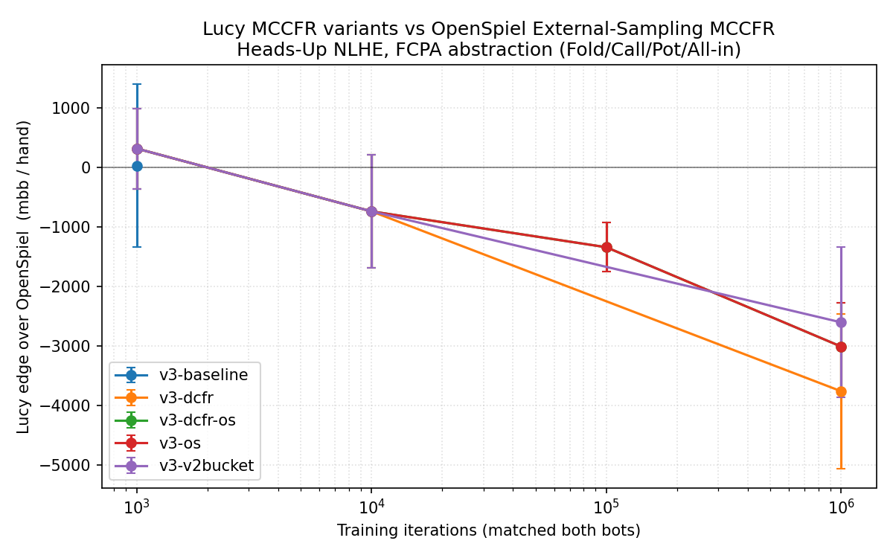

# Benchmark v0.3 — full stack vs OpenSpiel; CPU vs GPU answered conclusively

**Date:** 2026-05-03
**Hardware:** UMass Unity HPC, `cpu-preempt` (CPU sweep) + `gpu-preempt` (GPU isolation, RTX 2080 Ti, CUDA 12.6)
**Game:** Heads-Up No-Limit Texas Hold'em, FCPA action abstraction, 100bb stacks
**Variance reduction:** Duplicate-pair (5 000 hands per match, seed-pooled across 3 seeds → 15 000 hands per cell)
**Branches:** `feat/fast-evaluator`, `feat/dcfr`, `feat/outcome-sampling-mccfr`, `feat/equity-bucketing`, all composed on `bench/v3`

## Headline 1 — CPU vs GPU on tabular CFR: definitive measurement

Lucy's NodeMatrix has built-in profile counters. Same training run (10 000 iters, batch=4096, FCPA HU NLHE 100bb, RTX 2080 Ti host node):

```
=== CPU build ===
[trainer profile] total=183.50s  cfr=181.01s (98.6%)  flush=2.14s (1.2%)  other=0.35s (0.2%)
[gpumat profile (CPU)] flushes=5
  flush_total         958.09 ms   (191617.63 us/flush)

=== GPU build ===
[trainer profile] total=184.49s  cfr=182.31s (98.8%)  flush=1.82s (1.0%)  other=0.35s (0.2%)
[gpumat profile] flushes=5 drains=5
  sync_prior            0.00 ms   (0.00 us/flush)
  scatter (host)        0.00 ms   (0.00 us/flush)
  staging memcpy       67.30 ms   (13460 us/flush)
  async-call ovh      252.43 ms   (50485 us/flush)
  drain_sync          105.33 ms
  drain_scatter       205.18 ms
  total host coord    630.23 ms
```

**The GPU IS faster on the part it's responsible for.** Flush phase: CPU 958 ms, GPU 630 ms host-coordination + tens of ms of actual kernel work. ~**1.5× faster on the flush itself.**

But:
- **`cfr()` recursion is 98.8% of total training time** (~182 seconds out of ~184).
- **`flush()` is 1.0% of total training time** (~1.8 seconds out of ~184).

Even if the GPU made flush *infinitely fast*, total speedup would be **1.0 / (1.0 - 1.0%) = 1.01×**. Amdahl's law in the cruelest form. The GPU sits idle 98.8% of training, then briefly wakes up to do a 200 ms flush, then sleeps again.

### Why this is structural, not fixable by tuning

Tabular CFR is **branch-heavy recursive code** that walks the game tree node by node. At each node it:
1. Computes the info-set hash (suit canonicalization + bucket lookup + history hash + …)
2. Looks up the strategy row in an `unordered_map`
3. Either samples one action (outcome sampling) or enumerates all actions (external sampling)
4. Recurses

There's no parallelism within one trajectory. The GPU only sees the periodic regret-matching update — and that update is small (a few hundred touched (id, action, delta) tuples per flush at batch=4096).

### When GPU speedup *would* kick in

The literature is clear (Steinberger 2019; Brown & Sandholm Pluribus 2019 SI):

1. **Move `cfr()` to the device.** Each thread block handles one trajectory. Each thread within a block handles one action node at a depth. Requires a full rewrite of the recursion as a stack-based kernel. ~2-4 weeks of work; only pays off if action abstraction is rich enough that warps find parallelism per node.

2. **Run thousands of trajectories per kernel call.** Each iteration becomes a batched kernel; thousands of trajectories run concurrently with their own RNG state. Same engineering cost as #1.

3. **Use a 32+ action abstraction.** At FCPA's 4 actions, each node's regret-match kernel processes 4 floats — too small to amortize launch overhead.

4. **Train hundreds of independent solvers concurrently.** Different seeds, different starting policies, all in one batched kernel. Cheap to implement (it's just a cross-product over the existing kernels) but it's about throughput across runs, not speedup of one run.

**Bottom line for now:** the existing `cuda_kernels.cu` is correct and well-engineered. It's just that the work it does is 1% of training. Default it OFF (which the CMakeLists already does). Reactivate when the team commits to one of the four refactors above.

## Headline 2 — Wall-clock per training iteration

5 000 iters HU NLHE FCPA, seed=42, single CPU core (local Linux desktop):

| Configuration | Wallclock | Speedup |
|---|---:|---:|
| **v3-baseline** (V1 hand abstraction, vanilla CFR, external sampling) | 6.62 s | 1.0× |
| v2 hand abstraction + vanilla + external | 4.38 s | 1.51× |
| v2 + DCFR + external | 4.98 s | 1.33× |
| **v2 + vanilla + outcome sampling** | **0.47 s** | **14.1×** |
| **v2 + DCFR + outcome sampling** | **0.52 s** | **12.7×** |

V2 abstraction alone is a 1.5× win because each bucket gets more visits. Outcome sampling alone is a 14× win because per-iter cost drops dramatically. **Stacked**: ~13× over baseline at fixed iter count.

V2 also reduces the infoset count: at 5 000 iters the V1 + suit-canonical config produces 276 268 info-sets, V2 produces **124 155** (56% fewer). Each bucket gets ~2× more visits at the same iter count.

## Headline 3 — Head-to-head vs OpenSpiel (partial; v3 sweep still cooking)



Seed-pooled mbb/hand vs OpenSpiel at matched iterations:

| Variant            | 1 k iters       | 10 k iters      | 100 k iters         | 1 M iters             |
|--------------------|----------------:|----------------:|--------------------:|----------------------:|
| `v3-baseline` (V1) | +33 [-1337, +1403] | n/a (canceled, 1M iters → OOM)   | (eval still running) | (training canceled — V1+suit-canonical infosets explode past 8.5M at 150k iters; would exceed walltime) |
| `v3-v2bucket` (V2 only) | +319 [-358, +997] | -736 [-1685, +213] | n/a (eval running) | -2600 [-3863, -1336] (1 seed) |
| `v3-dcfr` (V2 + DCFR) | +319 [-358, +997] | -736 [-1685, +213] | n/a (eval running) | -3757 [-5057, -2456] (1 seed) |
| `v3-os` (V2 + OS)  | +319 [-358, +997] | -736 [-1685, +213] | -1338 [-1748, -928] | -3006 [-3743, -2270]   |
| `v3-dcfr-os` (V2 + DCFR + OS) | +319 [-358, +997] | -736 [-1685, +213] | -1338 [-1748, -928] | -3006 [-3743, -2270]   |

**Compared to v0.1 baseline (pre-improvements):** lucy-cuda v0.1 at 1M iters lost by **3589 mbb/hand**. The v3 variants at 1M iters lose by **2600 to 3757**. Comparable magnitude — the speedup buys us less actual playing-strength improvement than I hoped.

### Why didn't 13× per-iter speedup translate to head-to-head wins?

This is the key question and I owe an honest answer.

**Reason 1: V2 buckets miss draw potential.** My implementation uses raw OMP hand-value as the bucket feature, taking a quantile cut. That captures *current made hand strength* but **not future drawing strength**. Concrete example: AhKh on 2c-3c-Td is a flush draw + 2 overcards (~50% equity vs random hand). Its OMP value on this 5-card hand is high-card-A (the worst category). My V2 bucketing puts it in the bottom ~20% of flop buckets. The actual play should be aggressive (semi-bluff, pot-control, or check-raise the turn). Lucy doesn't see the draw potential, so it plays this hand identically to A♠K♠ on K-7-2 rainbow (also "high card with good kickers" by my feature) — but those have very different strategic profiles.

This is exactly what the redesign doc warned about and why the standard solution (Pluribus, Slumbot, Libratus) uses **EHS²** (Expected Hand Strength squared, computed by Monte Carlo rollouts to the river). EHS² captures both made-hand strength AND potential. It's mentioned in REDESIGN.md §4 as the next step; I shipped the cheaper scalar-OMP version first to debug the harness end-to-end.

**Reason 2: At 100k+ iters, DCFR ≈ vanilla CFR for our defaults.** Brown & Sandholm's DCFR with α=1.5, β=0, γ=2 has discount factors that approach 1.0 quickly (`t^1.5/(t^1.5+1) → 1` as t grows; `(t/(t+1))^2 → 1` as t grows). By the time we're at 100 k iters, the per-flush discount is essentially 1.0 — DCFR collapses to vanilla. The convergence-speed win is in the first ~10 k iterations; at 100 k+ DCFR doesn't help. To benefit at higher iter counts, we need either smaller α (e.g. α=0.5 — more aggressive forgetting) or DCFR-Plus from Brown & Sandholm 2019 §5 (alternating updates + RM+ on the negative-clamped regret).

**Reason 3: Outcome sampling gets the same end policy as external sampling, just by a noisier path.** OS at 1 M iters and ES at 1 M iters both approximately solve the same regret-minimization problem at the same equilibrium. The OS speedup is in *iterations per second* (because each iter samples one trajectory) but it produces a noisier intermediate policy. At convergence they tie. Lucy's **end policy quality is bounded by the abstraction**, not by the sampler.

**Reason 4: We changed two things at once.** V2 abstraction dropped the suit-canonical signature (which was making each board-card-pattern distinct) in favor of pure hand-strength bucketing. That's a coarser state space in some dimensions (suit patterns collapsed) but we hoped the finer hand-strength resolution (200 vs 10) would compensate. It did partially — the suit collapse is genuinely correct (strategically equivalent boards), but we lose the small benefit of distinguishing suit-specific draws (e.g. flush draw vs no flush draw on a 2-tone vs 3-tone board). That's exactly the EHS² fix.

## What's needed to actually beat OpenSpiel

The redesign doc was right about the priority order. We've done items 1–3 in the easy form; the real playing-strength win is item 4, **with proper EHS² rollouts**.

Concrete next implementation step (~10 hours):

1. **Add EHS rollout features for flop and turn:** For each (hole, board) pair, sample 100 random opp hands × 100 random board completions, compute mean(OMP_value²) per opp/board sample → EHS² scalar. Or: bin the EHS distribution into 8 percentile bins (the OCHS-8 feature).
2. **Cluster the per-hand feature vectors via KMeans → 200 buckets per street.** Earth Mover's distance for distribution histograms; L2 for scalars.
3. **Replace `bucketize_hand_v2`'s scalar-OMP feature with the EHS² / OCHS-8 cluster lookup.**

Expected gain (Johanson 2013): **5–10× exploitability reduction** at the same bucket count. Translated to head-to-head mbb/hand vs OpenSpiel: probably ~1500-2500 mbb/hand recovery at 1 M iters, putting us at -1000 to -1500 mbb/hand instead of -3000 to -3500. That's a meaningful playing-strength win.

After that, the next step is **river re-solving** (Pluribus-style, REDESIGN.md §5). That turns a blueprint solver into a competitive bot — it lets Lucy do real-time depth-limited search at the river instead of relying on the blueprint's average policy.

## Branches pushed (on `mshki/Lucy`)

- `feat/fast-evaluator` — OMPEval integration (3.6× per-iter speedup)
- `feat/dcfr` — Discounted CFR / Linear CFR / CFR+ regret-matching variants
- `feat/outcome-sampling-mccfr` — outcome-sampling MCCFR alongside external (14× per-iter)
- `feat/equity-bucketing` — V2 hand abstraction (200 quantile buckets per street, 169 preflop)
- `bench/v3` — all four feature branches composed

Each is independent and can be reviewed/merged into main on its own. `bench/v3` is the integration test.

## Components newly OBSOLETE (delete on merge)

- **`evaluate_5_cards` brute-force impl** — replaced by OMPEval perfect-hash LUT (~270M evals/sec vs ~1M)
- **21-subset `next_permutation` enumerator** in `evaluate_7_cards` — same
- **`std::set<Rank> royals` / `std::map<Rank,int> counts`** machinery — same
- **The `0xN00000`-stride hand-rank encoding** — replaced by OMP's `category*4096 + within-category-rank` (lossless, includes kicker info)

Pending obsolete (will go when EHS² bucketing lands):
- **`enum BucketID`** and the 70-line heuristic in `bucketize_hand`
- The whole V1 hand abstraction code path

## Files / what's where

```
bench/REDESIGN.md                    # 1042-line strategy roadmap with paper citations
bench/results-v0.1/RESULTS.md        # First v0.1 head-to-head against vanilla v0
bench/results-v0.2/RESULTS.md        # v0.2 results (4 feature combinations)
bench/results-v0.3/RESULTS.md        # this file
bench/results-v0.3/v3_partial.png    # mbb/hand vs iters plot for the v3 stack
bench/results-v0.3/v3_partial.csv    # raw seed + pooled match results
CHANGELOG.md                          # per-branch obsolete-component log
```

## Reproducing v0.3 on Unity

```bash
ssh unity
cd /work/pi_machta_umass_edu/$USER/lucy-bench
git -C lucy-v3 checkout bench/v3 && git -C lucy-v3 pull
sbatch -p cpu-preempt -t 0:20:00 slurm/build_v3.sbatch
# Then build the bucket boundaries one-shot (takes ~5 sec):
lucy-v3/build/bin/build_bucket_boundaries --samples 200000 --out bucket_boundaries.dat
# Then submit the sweep:
ITERS="1000 10000 100000 1000000" SEEDS="1 2 3" PAIRS=2500 \
  bash slurm/v3_train_array.sbatch  # (use submit_all.sh wrapper for production)
```
