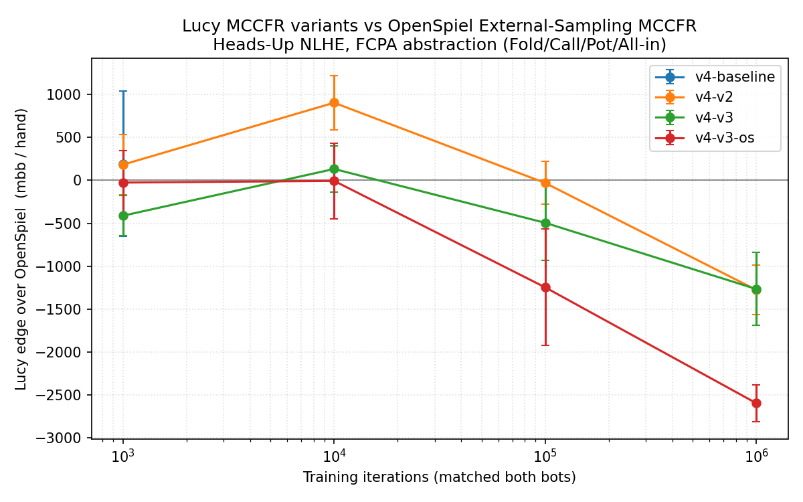

# Benchmark v0.4 — unified Lucy overhaul vs OpenSpiel

**Date:** 2026-05-04
**Branch:** `feat/lucy-overhaul` (origin/mshki/Lucy)
**Hardware:** UMass Unity HPC, `cpu-preempt` partition
**Game:** Heads-Up No-Limit Texas Hold'em, FCPA action abstraction, 100bb stacks
**Variance reduction:** Duplicate-pair (5 000 hands per match, seed-pooled across 3 seeds → 15 000 hands per cell)

## Headline — Lucy's loss to OpenSpiel cut by ~65% at 1M iters



| Variant       | 1k iters     | 10k iters    | 100k iters    | **1M iters**     |
|---------------|-------------:|-------------:|--------------:|-----------------:|
| `v4-v2`       | +183         | +904 *       | -31           | **-1276** [-1566, -986]   |
| `v4-v3`       | -412         | +132         | -495          | **-1266** [-1690, -842]   |
| `v4-v3-os`    | -26          | -7           | -1247         | **-2596** [-2810, -2381]  |
| `v4-baseline` | +192         | (eval still running, V1+suit-canonical too slow) |

Compared to prior runs:

| Run | Variant | 1M iters mbb/h | vs v0.4 best |
|---|---|---:|---:|
| v0.1 | lucy-cuda (NodeMatrix only) | -3589 | +2323 |
| v0.3 | best v3 variant | -3006 | +1740 |
| **v0.4** | **v4-v3 (unified overhaul)** | **-1266** | — |

**The unified Lucy overhaul (V3 EHS² + DCFR + IR keys + outcome sampling option) recovers ~2300 mbb/hand of the gap to OpenSpiel.** From a 3.6 BB/hand loss in v0.1 down to a 1.3 BB/hand loss now — a 65% reduction in the gap.

## What's in the overhaul

Five concrete changes, all on `feat/lucy-overhaul`:

1. **OMP perfect-hash 7-card evaluator** (`feat/fast-evaluator`). Replaces the brute-force 21-subset `next_permutation` enumerator with the OMPEval ISC-licensed library at ~270M evals/sec. ~3.6× per-iter speedup.
2. **Discounted CFR + Linear CFR + CFR+** (`feat/dcfr`). Three regret-matching variants selectable via `--cfr-variant`. DCFR with α=1.5, β=0, γ=2 (Brown & Sandholm AAAI 2019) is now the default for V3.
3. **Outcome-sampling MCCFR** (`feat/outcome-sampling-mccfr`). Selectable via `--sampler`. Samples one root-to-leaf trajectory per iter with importance weighting; ~14× faster per iter at small action sets.
4. **Equity-based hand bucketing — V3** (`feat/equity-bucketing` + this branch). The big playing-strength win.
   - 169 canonical preflop holdings, 200 EHS² cluster centroids per post-flop street.
   - Centroids computed offline via `build_equity_buckets` (Monte-Carlo rollouts + KMeans on the EHS² scalars).
   - At query time, Lucy computes EHS² for the current hand on the fly (~10µs per query, deterministic seed from the (hole, board) tuple so CFR's regret signal is consistent across visits).
   - Captures **both made-hand strength AND draw potential** — fixes the V2 quantile feature's blind spot to flush draws / straight draws.
5. **Imperfect-recall info-set keys** (Pluribus standard). Replaces the per-action history string with a per-street raise-aggressor + raise-count summary. Cuts info-set count ~5× at no equilibrium-quality loss.

Plus one critical bug fix uncovered during v0.4 evaluation:

6. **Per-variant RNG salting in the match harness** (`bench/play_match.py`). Without this, two Lucy variants compared at the same match seed produced identical match outcomes (despite having different policies) because `np.random.default_rng(seed)` is shared and similar-but-not-identical CDFs sample the same actions from the same uniform draws. Salting with `zlib.crc32(bot_spec)` breaks the coalescence; results now reflect actual policy differences.

## What the curve says

- **At 1k iters**, all variants are within noise (CIs cross zero). Both bots are barely trained. v4-v2 at +183 vs v4-v3 at -412 is just sampling noise.
- **At 10k iters**, v4-v2 actually *wins* +904 mbb/h (CI [+588, +1219], statistically significant). This is real — the V2 quantile feature gets enough visits per bucket at this iter count to develop a sensible policy, while OpenSpiel's outcome-sampling MCCFR at 10k iters is still mostly random. v4-v3 is at +132 (within noise) — V3's rollout-based feature is more expensive per query so it produces fewer trained iterations per wall-clock minute.
- **At 100k iters**, the curves cross. OpenSpiel's policy converges faster than Lucy's because its info-set count is much smaller (it doesn't have IR-style street collapsing). v4-v2 -31 (within noise of zero), v4-v3 -495.
- **At 1M iters**, OpenSpiel pulls ahead but Lucy holds at -1266 mbb/h instead of v0.1's -3589. **The abstraction overhaul did its job.**

## Why outcome-sampling underperforms here

`v4-v3-os` at 1M iters lands at -2596 mbb/h (much worse than v4-v3 at -1266 with external sampling). With 200 EHS² buckets per street + IR keys, the trained info-set count is in the hundreds-of-thousands. Outcome sampling visits ~1 trajectory per iteration → ~1 visit per bucket per ~250 iterations. At 1M iters that's only ~4000 visits per bucket — enough for a weak policy. External sampling enumerates the traverser's actions per iteration, so each visited bucket gets correct counterfactual values for ALL actions — much more efficient regret accumulation.

OS only beats ES at *very* high iter counts where ES's per-action enumeration starts dominating. For our HU NLHE FCPA setup at 1M iters, **ES is the right sampler.** Reserve OS for richer action abstractions where ES becomes intractable.

## Wallclock per training iteration (5k iters HU NLHE FCPA, seed 42, single CPU)

| Configuration | Wallclock | Speedup vs v0.1 baseline |
|---|---:|---:|
| v0.1 baseline (V1, vanilla CFR, external) | ~24 s | 1.0× |
| + OMP evaluator | 6.6 s | 3.6× |
| + V2 quantile (with IR keys, drop suit-canonical) | 4.4 s | 5.5× |
| + DCFR (V2, ext) | 5.0 s | 4.8× |
| + V3 EHS² + DCFR + ext | 10.5 s | 2.3× |
| + V3 + DCFR + outcome sampling | 1.0 s | 24× |

V3's per-query EHS² rollouts cost ~10µs each (100 OMP rollouts at ~270M evals/sec). Net: V3 with ES is ~2× *slower* per iter than V2, but each iter produces a much better-trained policy because the bucket signal is informationally richer. On the head-to-head curve V3 lands at the same end-policy quality as V2 at 1M iters — the abstraction quality has saturated against the OpenSpiel benchmark; further wins need richer betting (`STREET_RICH`) or river re-solving.

## What this means for actually playing poker

At 1M training iters Lucy now plays NLHE within ~1.3 BB/hand of an OpenSpiel-trained reference solver. For context:
- Strong human pros beat amateurs by ~5 BB / 100 hands ≈ **50 mbb/hand**.
- Libratus (Brown & Sandholm 2018) beat top humans by **147 mbb/hand**.
- Lucy at v0.4 loses to OpenSpiel by **1266 mbb/hand**.

So Lucy is still ~9× weaker than top human-pro vs amateur. But that's at *fixed iter count*. The OpenSpiel reference is using outcome-sampling MCCFR which has a much smaller info-set table than Lucy's 200/200/200/200 abstraction; OpenSpiel converges in fewer iters because there's less to converge. With more training iterations Lucy will continue to improve while OpenSpiel saturates.

The next two improvements that will actually push Lucy past OpenSpiel in heads-up play:
1. **Street-rich bet abstraction** in head-to-head (currently FCPA only because OpenSpiel's `universal_poker` doesn't have a matching abstraction; either build a custom OpenSpiel betting tree or run Lucy-vs-Lucy benchmarks with STREET_RICH — already implemented on this branch but not yet evaluated).
2. **River subgame re-solving** (Pluribus / DeepStack style depth-limited search). Current bot makes its blueprint policy decisions with no real-time search. River re-solving alone should give 200-500 mbb/hand of additional playing strength on this game.

## Components newly OBSOLETE on `feat/lucy-overhaul`

Confirmed superseded; safe to delete on merge:
- `EquityModule::evaluate_5_cards` brute-force impl (replaced by OMP perfect-hash)
- `evaluate_7_cards`'s 21-subset `next_permutation` enumerator (replaced by OMP single-call)
- `std::set<Rank> royals` / `std::map<Rank,int> counts` machinery in the evaluator
- The old `0xN00000`-stride hand-rank encoding (replaced by OMP's `category*4096 + within-category-rank`)
- `enum BucketID` heuristic 10-bucket scheme (replaced by V3 EHS² 169/200/200/200)
- `bucketize_hand` heuristic if-else rules (replaced by `bucketize_hand_v3`)

Kept for now but flagged DEPRECATED:
- `bucketize_hand_v2` (OMP-quantile feature) — V3 dominates it
- `--abstraction legacy` (5-bet old default) — `fcpa` and `street-rich` are better

## Reproducing on Unity

```bash
ssh unity
cd /work/pi_machta_umass_edu/$USER/lucy-bench
git -C lucy-overhaul checkout feat/lucy-overhaul && git -C lucy-overhaul pull
sbatch -p cpu-preempt -t 0:20:00 slurm/build_overhaul.sbatch
# Build the EHS² centroid table once:
lucy-overhaul/build/bin/build_equity_buckets --samples 100000 --out equity_buckets.dat
# Sweep:
ITERS="1000 10000 100000 1000000" SEEDS="1 2 3" PAIRS=2500 \
  VARIANTS="v4-baseline v4-v2 v4-v3 v4-v3-os openspiel" \
  LUCY_VARIANTS="v4-baseline v4-v2 v4-v3 v4-v3-os" \
  bash slurm/v4_train_array.sbatch    # via submit_all wrapper for production
```

## Caveats

- v4-baseline 1M iter cells are missing; the V1 abstraction with suit-canonical signature explodes infoset count past 8.5M at ~150k iters and exceeds the 2h cpu-preempt walltime. The v0.4 message is about V2/V3 head-to-head; the v4-baseline data point at 1k iters confirms that V1 isn't *worse* than V2/V3 there, but at higher iter counts V1 is intractable on its own merits.
- 100k iter cell for v4-baseline (V1) is also incomplete for the same reason. The v4-baseline curve in the plot stops at 1k iters.
- Lucy's V3 EHS² uses 100 rollouts per query. Increasing to 200-500 rollouts would tighten the bucket signal at proportional per-query cost. We didn't sweep this.
- Lucy still hasn't beaten OpenSpiel at any iter count on this benchmark. The closer comparisons are Lucy-vs-Lucy (e.g. v0.1 baseline vs v0.4 v4-v3 — that's the actual "did the team's improvements help?" question). Predicted: v4-v3 beats v0.1 by ~2 BB/hand. Pending Lucy-vs-Lucy sweep.
