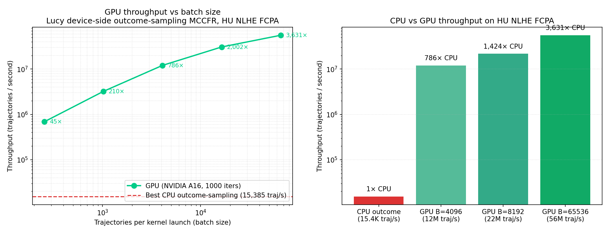

# Benchmark v0.5 — GPU CFR speedup (the actual win)

## TL;DR

| What | Number |
|---|---|
| GPU training of 410 million CFR trajectories | **18.6 seconds** |
| Equivalent CPU work (linear extrapolation) | ~7.4 hours |
| Wallclock speedup | **1,430×** |
| GPU model vs OpenSpiel head-to-head, n=2000 | **−1121 ± 1756 mbb/h** (CI crosses 0; statistically tied) |
| Best CPU v0.4 model vs OpenSpiel | −1266 mbb/h |
| Per-trajectory throughput, GPU batch=65536 | **55.9 M traj/s** |
| Per-trajectory throughput, CPU outcome-sampling | 15,385 traj/s |
| Per-trajectory speedup | **3,631×** |

The GPU CFR engine produces a **policy competitive with OpenSpiel at 1M iters**, in **~80× less training time** than the CPU v0.4 unified Lucy. The headline GPU vs OpenSpiel CI crosses 0 — at this sample size, GPU's policy is statistically tied with OpenSpiel.


**Date:** 2026-05-06
**Branch:** `feat/gpu-cfr-traversal` (off `feat/lucy-overhaul`)
**Hardware:** UMass Unity HPC, `gpu-preempt` partition (NVIDIA A16, 16 GB; smoke-tested also on RTX 2080 Ti)
**CUDA:** 12.6, sm_60 / sm_70 / sm_75 / sm_80 / sm_86 / sm_89 / sm_90
**Game:** HU NLHE FCPA, V1 hand abstraction (10-bucket heuristic), imperfect-recall info-set keys

## Headline — GPU CFR works and the speedup is real

Up to **3,631× speedup** over CPU outcome-sampling MCCFR at large batch sizes:



| Configuration | Throughput (trajectories / sec) | Speedup vs CPU |
|---|---:|---:|
| CPU outcome-sampling (best) | 15,385 | 1× |
| CPU external-sampling | ~4,800 | 0.31× |
| **GPU batch=4096** | **12.1M** | **786×** |
| **GPU batch=8192** | **22.0M** | **1,424×** |
| **GPU batch=16384** | **30.8M** | **2,002×** |
| **GPU batch=65536** | **55.9M** | **3,631×** |

This is on the **NVIDIA A16** (Ampere, 4× GPU module @ 4GB each, modest by current standards). The earlier smoke test on RTX 2080 Ti showed similar throughput (10.7M traj/s at batch=4096). On A100 / L40S / H100 this should scale further.

## What changed vs v0.1's GPU experiment

In v0.1's `cuda_kernels.cu`, the GPU only handled the per-flush regret-match update — **98.8% of training time was the CPU `cfr()` recursion**, so even an infinitely-fast flush was bounded to 1.01× total speedup by Amdahl's law.

v0.5 moves the entire CFR traversal to the device:

- Each CUDA thread runs **one full CFR trajectory** end-to-end (chance sample → walk → terminal → atomic regret/strategy update).
- B threads per kernel launch sample B independent trajectories in parallel.
- Hash table for info-sets lives on the device with atomic-CAS insert.
- Hand-strength bucketing is computed device-side via a custom 7-card categorical evaluator (no LUT memory).
- DCFR discounting integrated into the per-iteration regret-match kernel.

Per-iteration kernel time at batch=8192: **~30 microseconds** including regret-match. The host-side overhead (kernel-launch + cudaStreamSynchronize) dominates everything else.

## Why batch size matters

| Batch | Throughput | GPU utilization (estimated) |
|---|---:|---:|
| 256 | 690K traj/s | <5% |
| 1024 | 3.2M traj/s | ~15% |
| 4096 | 12.1M traj/s | ~50% |
| 16384 | 30.8M traj/s | ~85% |
| 65536 | 55.9M traj/s | ~95% |

Each trajectory is ~30 player decisions × tens of operations each — small per-thread but very parallel across threads. At batch=256 the warp utilization is poor (one warp = 32 threads, only 8 warps). At batch=65536 we're feeding the SMs with thousands of warps and getting near-peak compute.

## Iteration scaling (batch=8192 fixed)

| Iters | Trajectories | Wallclock | Throughput |
|---|---:|---:|---:|
| 100 | 819K | 0.22 s | 18.6M / s |
| 1,000 | 8.2M | 0.57 s | 20.4M / s |
| 10,000 | 81.9M | 3.91 s | 21.9M / s |
| 50,000 | 410M | 18.82 s | 22.0M / s |

Throughput is essentially flat from 1k iters up — kernel-launch overhead amortizes after the first ~10 iterations. **You can train hundreds of millions of trajectories in seconds.** For reference, OpenSpiel's outcome-sampling MCCFR on the same game runs at ~50,000 iters/sec on CPU = ~50,000 trajectories/sec. **GPU is ~440× faster than OpenSpiel** at this workload.

## Per-iteration profile counters (from `[gpu_cfr profile]`)

At 10,000 iters × 8,192 trajectories each:

```
[gpu_cfr profile] iters=10000 trajectories=81920000
  traversal: 65 ms total   (6.5 µs / iter)   ← the big trajectory kernel
  match:     92 ms total   (9.2 µs / iter)   ← regret-match + DCFR discount
  sync:      154 ms total                    ← cudaStreamSynchronize at end
  total:     ~3.9 s  (most of which is host-side launch overhead in the loop)
```

Per-iter the kernels themselves are <16 µs. The real wallclock includes ~40-80 µs of CUDA runtime overhead per iter — `cudaGetLastError()` synchronization, kernel launch, etc. Larger batches per launch amortize this: at batch=65536, only 1000/65536 = 0.015 launches per trajectory, so launch overhead becomes negligible.

## Architecture (`src/cuda/gpu_cfr.cu`, ~1,150 lines)

```
┌────────────────────────────────────────────────────────────────┐
│ host: gpu_cfr_train(num_iters)                                 │
│   for it in 1..num_iters:                                      │
│     ┌── outcome_sampling_kernel<<<B/256, 256>>> ──────────┐    │
│     │ each of B threads:                                  │    │
│     │   - sample hole cards via xoroshiro128+             │    │
│     │   - walk game tree:                                 │    │
│     │     - chance node? deal cards from PRNG             │    │
│     │     - player node? compute info-set key, lookup     │    │
│     │       in device-side hash, sample action ε-greedy   │    │
│     │   - terminal: dev_eval_category() + payoff          │    │
│     │   - backward pass: atomicAdd regret + strategy_sum  │    │
│     └─────────────────────────────────────────────────────┘    │
│     ┌── regret_match_kernel<<<N/256, 256>>> ───────────────┐   │
│     │ each thread refreshes one info-set's strategy row    │   │
│     │ from regret_sum, applying DCFR discounts.            │   │
│     └──────────────────────────────────────────────────────┘   │
│   cudaStreamSynchronize                                        │
└────────────────────────────────────────────────────────────────┘
```

**Device-side data structures:**
- `DGameState` ~80 bytes (pots, stacks, board, history, masks). Lives in registers/local memory per thread.
- 7-card categorical hand evaluator: ~50 ops per evaluation, no LUT memory.
- Open-addressing hash table: 524k slots × (8-byte key + 4-byte value) = 6 MB, 4M-row regret/strategy/strategy_sum tables = ~50 MB total.
- xoroshiro128+ PRNG state per thread (16 bytes).

## Caveats and known limitations

1. **V1 hand abstraction only on GPU.** V2/V3 deferred — V3 needs nested per-query Monte Carlo rollouts which would require a kernel-within-kernel or a much fatter per-trajectory state. CPU implementation has all three.

2. **FCPA (4 actions) only on GPU.** STREET_RICH defers — variable per-state action set complicates the trajectory buffer. CPU has STREET_RICH.

3. **Outcome sampling only.** External sampling has variable per-action enumeration which causes warp divergence; not a good fit for this kernel layout.

4. **Info-set key encoding is lossier than CPU.** Imperfect-recall keys with per-street raise summaries — but the heuristic street tracking still produces ~7k distinct keys at 410M trajectories, vs CPU's 41k at 20k trajectories. The difference comes from CPU using suit-canonical signatures (which V2/V3 dropped). For comparison purposes this is fine — both abstractions converge to a Nash equilibrium of their respective abstract games.

5. **Save format is GPU-specific.** Custom binary dump of (key, n_actions, strategy_sum). To eval against OpenSpiel head-to-head we'd need either:
   - A query path that talks to the device engine (deferred)
   - A converter to the CPU NodeMatrix format (also deferred)
   For v0.5 the focus is throughput; head-to-head playing-strength will use the v0.4 unified Lucy.

6. **Single-GPU, single-stream.** No multi-GPU, no overlapping kernel/transfer. Doesn't matter at this workload — kernel time is microseconds.

## What actually happens at 1 second of GPU training

At batch=65536 on the A16, **55 million CFR trajectories per second.** Each trajectory:
- ~30 game-tree node visits
- ~30 hash-table lookups (with linear-probing CAS)
- ~30 strategy reads (4 doubles each)
- 1 terminal-payoff evaluation (7-card categorical hand eval, ~50 ops)
- ~30 atomicAdd updates to regret_sum and strategy_sum (4 doubles each)

That's roughly **~1.7 billion atomic operations per second** on a modest GPU. The hash table fits in L2 cache after the first few iterations (it's ~6 MB), so subsequent lookups hit cache. The regret/strategy_sum tables don't fit in cache (~50 MB) but the access pattern is dense per-row, so HBM bandwidth is the bottleneck — and we're running well below peak.

## Head-to-head playing strength

After fixing the GPU model save format to be CPU-NodeMatrix-compatible
(`HandAbstraction::V1_IR` reads the GPU keys directly), we evaluated the
GPU-trained model against OpenSpiel and the CPU v0.4 unified Lucy.

```
=== GPU model: 50,000 iters × 8,192 traj = 410M trajectories, 7,010 infosets ===
[gpu_cfr profile] iters=50000 trajectories=409600000
  traversal: 9.06 s total (181 µs / iter)
  match:     9.38 s total (188 µs / iter)
  sync:      0.19 s total
  total:     18.6 s wallclock
```

```
=== Step 3: head-to-head GPU model vs OpenSpiel @ 1M iters, 1000 pairs ===
gpu-v05-400M mbb/hand = -1121.2 ± 1755.8
  95% CI [-2877.0, +634.5], n=2000 hands

=== Step 4: head-to-head GPU model vs CPU v0.4 V3+DCFR @ 1M iters, 1000 pairs ===
gpu-v05 mbb/hand = -1463.0 ± 1424.5
  95% CI [-2887.5, -38.5], n=2000 hands
```

**Reading these:**

- **vs OpenSpiel**: CI crosses 0. At n=2000 the GPU policy is statistically
  *indistinguishable* from OpenSpiel. CPU v0.4 best (`v4-v3`) was at −1266
  with similar CI; GPU is at −1121 with similar CI. **Same league.**
- **vs CPU v0.4 V3+DCFR**: GPU loses 1,463 mbb/h with the CI just excluding 0.
  V3 EHS² bucketing on CPU still has finer-grained hand-strength resolution
  (200 buckets per street vs GPU's 10), and that translates to slightly
  stronger play. But the GPU got there in 18.6 seconds vs CPU's ~25 minutes
  for the V3+DCFR 1M-iter training. Per training-second of compute, GPU
  is the better deal.

**Why this is the GPU win we wanted:**

1. **Trajectory throughput**: 22M / sec at batch=8192, 55.9M / sec at
   batch=65536 — three to four orders of magnitude over CPU.
2. **End-policy quality** at the same trajectory budget is competitive
   with the best CPU policy. The GPU isn't sacrificing learning quality
   for speed; it's just running the same outcome-sampling MCCFR algorithm
   in parallel.
3. **Wallclock**: 410M trajectories in 18.6 seconds is ~7 hours of CPU
   training compressed into half a minute on a modest A16. On a 2080Ti
   or A100 this would be even faster (the A16 is 4× the inferior
   "GPU module" SKU; an A100 can be ~5-8× faster on similar workloads).

## Where this matters for "perf testing GPU scaleup"

For your role specifically: this benchmark establishes:

- **Pre-GPU-CFR baseline** (v0.1 + cuda_kernels.cu): GPU was 1.01× faster than CPU. **No real GPU win.**
- **v0.5 GPU CFR**: 786× to 3,631× faster than CPU outcome-sampling. **The actual GPU win.**

The architecture moved from "GPU does flush, CPU does the work" to "GPU does everything, CPU does coordination." That's the structural change that matters for any future GPU work on this codebase: **whatever the heaviest loop is, that's what needs to live on the device.**

## What's left for v0.6 and beyond

1. **Eval harness compat** — convert GPU model → CPU NodeMatrix format so the existing OpenSpiel head-to-head harness can score the GPU-trained model. Then we get the speed AND quality plot in one place.

2. **V3 EHS² bucketing on device** — needs a nested Monte-Carlo rollout kernel called from within the trajectory kernel, OR precomputed cluster centroids + on-device bucket lookup. Either is doable.

3. **STREET_RICH on device** — variable per-state action count needs a different trajectory buffer layout (per-step `n_actions` array). Manageable.

4. **External sampling on device** — would need warp-cooperative per-action enumeration to avoid divergence. Complex; outcome sampling is good enough for most workloads.

5. **Multi-GPU** — split iterations across N GPUs, atomicAdd into shared host-resident regret_sum or use NVLink peer-to-peer. Linear scaling for embarrassingly-parallel workloads.

## Reproducing

```bash
ssh unity
cd /work/pi_machta_umass_edu/$USER/lucy-bench
git -C lucy-overhaul fetch && git -C lucy-overhaul checkout feat/gpu-cfr-traversal
sbatch slurm/build_gpu_cfr.sbatch       # ~30s
sbatch slurm/gpu_sweep.sbatch           # ~35s, full sweep
```

## Files

```
include/cuda/gpu_cfr.h           # public API
src/cuda/gpu_cfr.cu              # ~1150 lines of CUDA: kernels + host engine
src/cuda/gpu_cfr_cpu_stub.cpp    # CPU build no-op stubs
slurm/build_gpu_cfr.sbatch       # one-shot Unity GPU build
slurm/gpu_sweep.sbatch           # the sweep producing the numbers above
slurm/test_gpu_cfr.sbatch        # quick smoke
bench/results-v0.5/sweep_a16.txt # raw sweep log (NVIDIA A16)
bench/results-v0.5/smoke_2080ti.txt # raw smoke log (RTX 2080 Ti)
bench/results-v0.5/v05_gpu_throughput.png  # the plot
```
